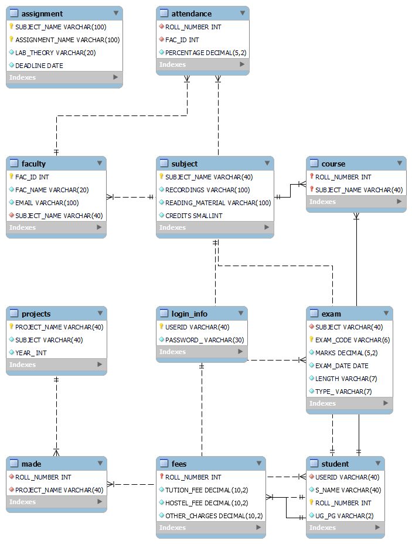

# Student-Portal-DBMS
Student Portal Database Management System

Designed and developed a Student Portal Database Management System using MySQL, consisting of 8 interconnected tables to manage student information, courses, fees, exams, and projects.

Implemented a normalized database schema with primary and foreign key constraints to ensure data integrity and minimize redundancy.

Developed complex SQL queries for CRUD operations and efficient data retrieval, facilitating smooth interaction with the student management system.

Integrated user authentication and authorization using a dedicated login table, ensuring secure access to the portal.

Achieved streamlined management of student records and academic information through robust relational database design and optimization.

